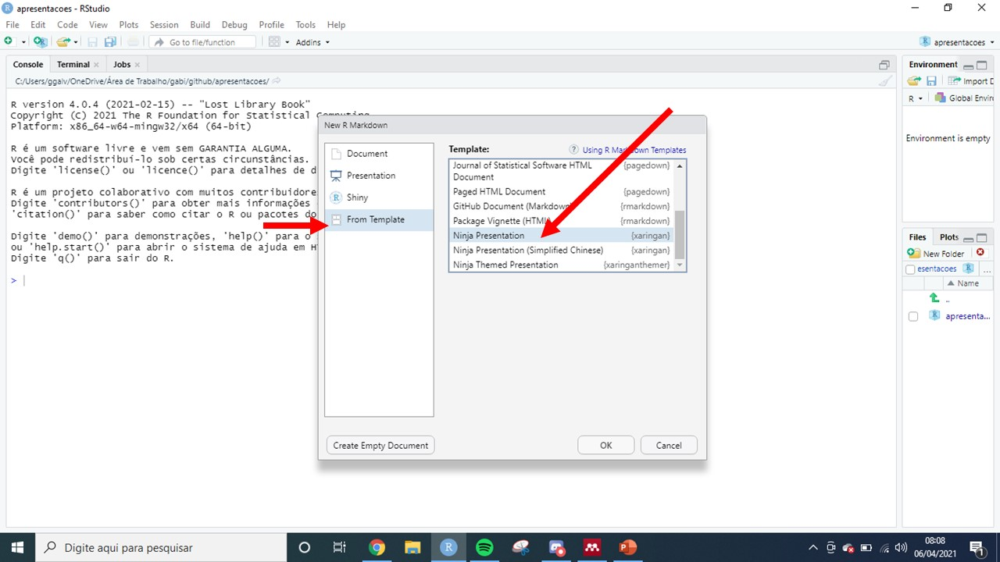
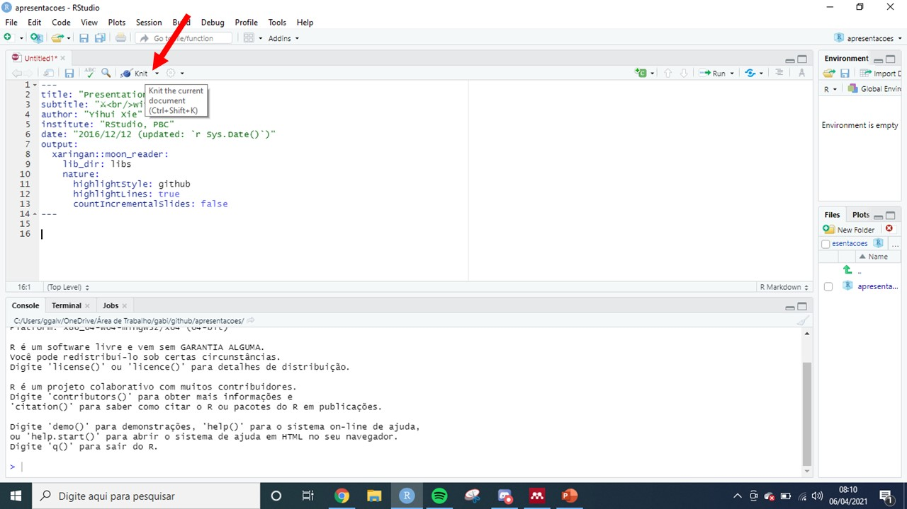
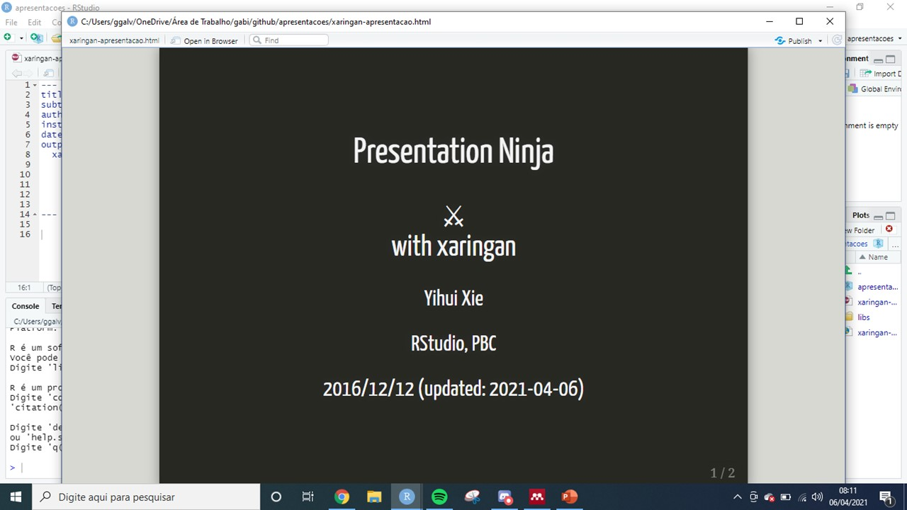
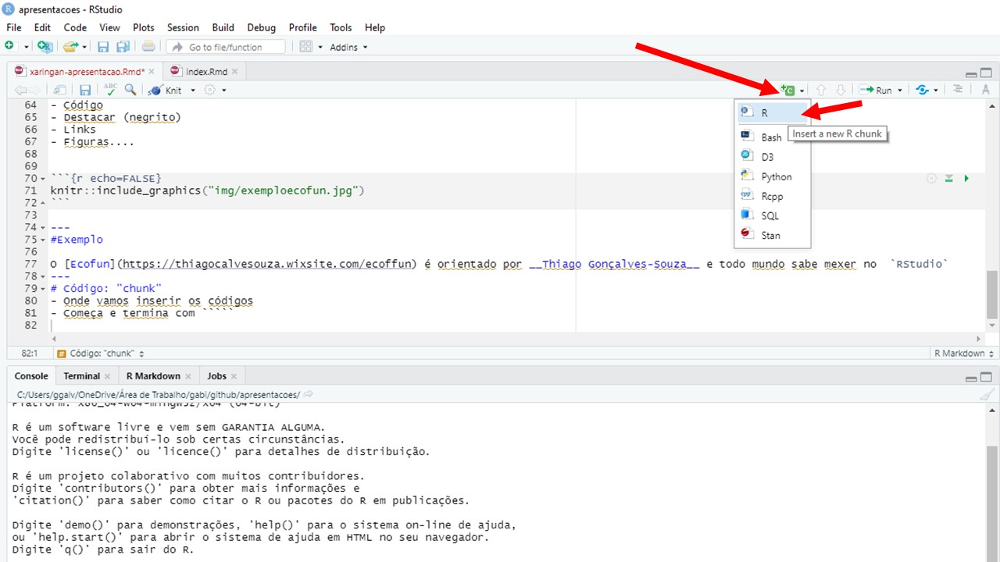
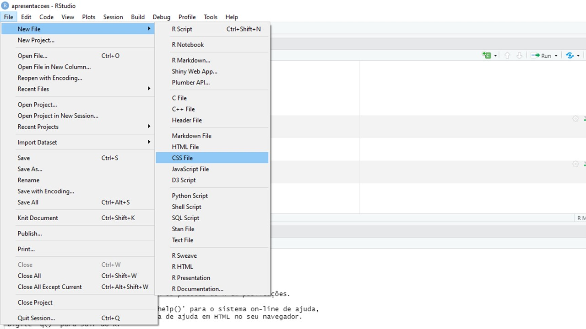
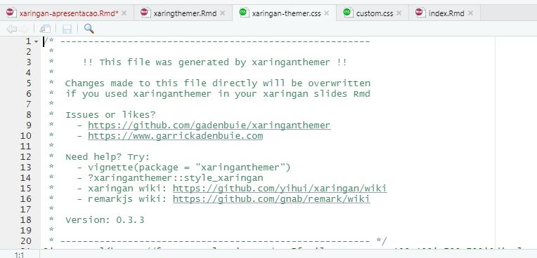

# Pré-requisitos
- Pacotes

```r
install.packages("xaringan")
install.packages("xaringanthemer")
install.packages("pagedown")
```
---
# Passo a passo
- Abra um markdown

```{r echo=FALSE}
knitr::include_graphics("img/abrir_markdown.JPG")
```
---
# Passo a passo
- From template > ninja presentation

```{r echo=FALSE}

```
---
# Passo a passo
- Apague o output
-"Knit" o código
```{r echo=FALSE}

```
---
# Passo a passo
- Apresentação inicial
- Podemos modificar essas informações
```{r echo=FALSE}

```
---
#Passo a passo
- O corpo dos slides você vai precisar do [markdown](https://www.rstudio.com/wp-content/uploads/2015/02/rmarkdown-cheatsheet.pdf)
```{r echo=FALSE}
knitr::include_graphics("img/corpo_slides.jpg")
```
---
Slide1
---
Slide
--
2
---
Sli
--
de
--
3
---
#Passo a passo
Podemos inserir:
- Código
- Destacar (negrito)
- Links
- Figuras....


```{r echo=FALSE}
knitr::include_graphics("img/exemploecofun.jpg")
```

---
#Exemplo

O [Ecofun](https://thiagocalvesouza.wixsite.com/ecoffun) é orientado por __Thiago Gonçalves-Souza__ e todo mundo sabe mexer no  `RStudio`

---
# Código: "chunk"
- Onde vamos inserir os códigos
```{r echo=FALSE}

```
---
# Código: "chunk"
- Output: `{r echo=FALSE}` ou `{r echo=TRUE}`
```{r echo=FALSE}
knitr::include_graphics("img/chunkferramenta.jpg")
```
---
# Código: "chunk"
- Inserindo uma tabela

```{r echo=TRUE}
mtcars
```
---
# Código: "chunk"
- Inserindo uma tabela

```{r echo=TRUE}
knitr::kable(mtcars)
```
---
# Inserir imagens
- Da internet

```{r echo=FALSE}
knitr::include_graphics("img/copiandofto.jpg")
```
---
# Inserir imagens
- Da internet

```{r}
knitr::include_graphics("https://static.wixstatic.com/media/c30fdf_e5102b5c82b04745b754ade80ef11640~mv2.jpeg/v1/crop/x_0,y_8,w_581,h_606/fill/w_282,h_294,al_c,q_80,usm_0.66_1.00_0.01/WhatsApp%20Image%202019-10-07%20at%2018_06_08_jp.webp.jpg")
```
---
#Inserir imagens
- Do seu computador

```{r echo=FALSE}
knitr::include_graphics("img/pasta.jpg")
```

---
#Inserir imagens
- Do seu computador

```{r}
knitr::include_graphics("img/arthur.jpg")
```

---
#Inserir imagens
- Ajeitar o tamanho
>{r, fig.align='right', out.width="30%"}
```{r, fig.align='right', out.width="30%"}
knitr::include_graphics("img/arthur.jpg")
```

---
#Desing da apresentação
- Temas do Xaringan
- {xaringanthemer}
- Alterando __CSS__: arquivo __custom.css__
---
#Desing da apresentação
- Temas do Xaringan
>você altera no slide título

```{r}
names(xaringan:::list_css())
```
---
#Desing da apresentação
- Temas do Xaringan
```{r echo=FALSE}
knitr::include_graphics("img/css.jpg")
```
---
#Desing da apresentação
- Alterando __css__
```{r echo=FALSE}

```
---
#Desing da apresentação
- Alterando __css__

```{r echo=FALSE}
knitr::include_graphics("img/customcss.jpg")
```
---
#Desing da apresentação
- Alterando __css__

```{r echo=FALSE}
knitr::include_graphics("img/paginacss.jpg")
```
---
#Desing da apresentação
- Alterando __css__
> Inspetor do navegador.

---

# slide

---
#Desing da apresentação
- xaringanthemer
> Ninja themed presentation

```{r echo=FALSE}
knitr::include_graphics("img/xaringtheme.jpg")
```
---
#Desing da apresentação
- xaringanthemer
> Ninja themed presentation

-Ele cria um .css
```{r echo=FALSE}

```
---
# Como compartilhar a apresentação?
- PDF
```r
pagedown::chrome_print("xaringan-apresentacao.html")
```
---
# Como compartilhar a apresentação?
- Disponibilizar online
> Netlify
> Github
